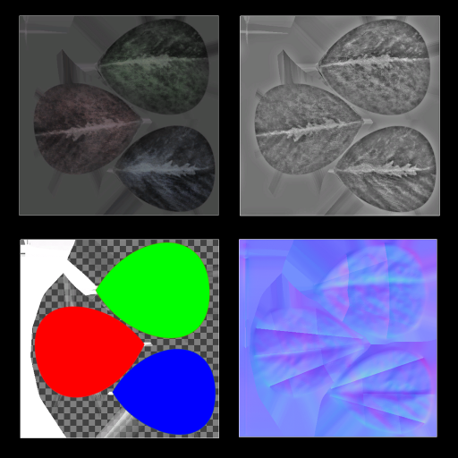
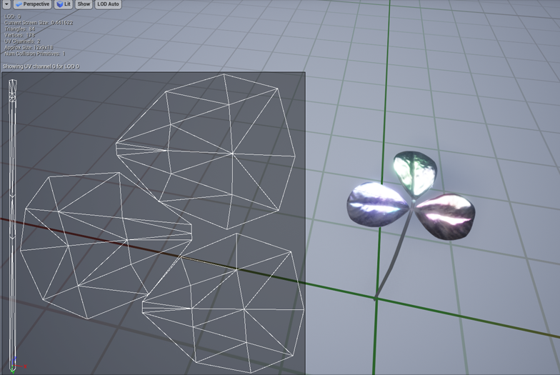
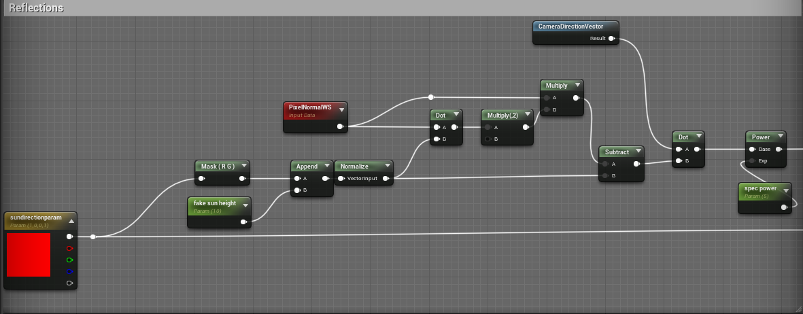
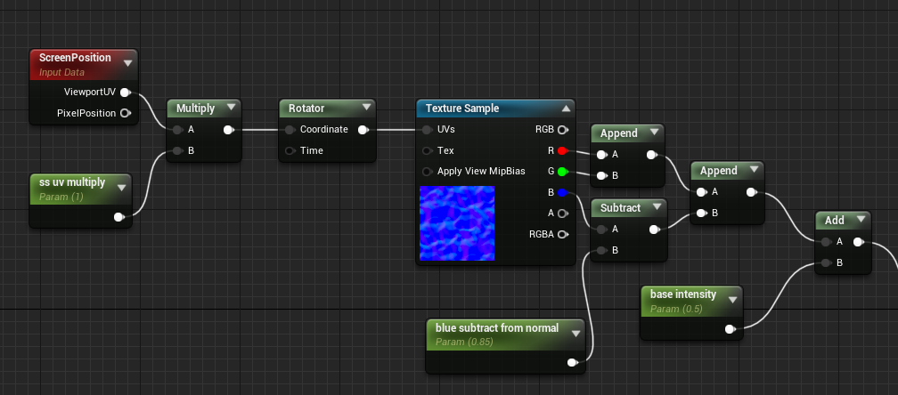

<!-- slide data-background-video="compressed_clover_intro.m4v" -->

<!-- slide -->
## Clover Shader
### Made in unreal Engine
<!-- slide -->
Textures have been made using Photoshop and Substance alchemists ability to generate normal and roughness maps. 
A custom emission channel was made in photoshop


<!-- slide -->
The model was made and unwrapped in Blender


<!-- slide -->
The Shader uses a Surface, Default Lit Model with a Masked Blend Mode to round out the corners on the clover.

<!-- slide -->
Reflection calculations are shown below. They are later multiplied with the emission map to give the clover glow


<!-- slide -->
The code bellow calculates the distance of every pixel from an imaginary line spanning between the camera and the sun

```c++
abs(
    lightdir.x*worldpos.y - lightdir.y*worldpos.x 
    + camerapos.x*(camerapos.y + lightdir.y) 
    - camerapos.y*(camerapos.x + lightdir.x)
);
```
<!-- slide -->
Lastly I added a texture that rotates in screenspace to add the mesmerizing light effect


<!-- slide data-background-video="compressed_clover_pan.m4v" -->
